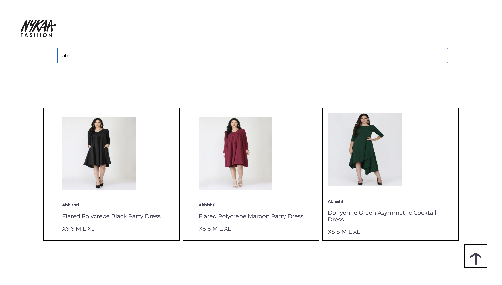

### Sample Node-React SSR setup.

##### Project Setup :-

1. Clone
2. cd react-node-ssr
3. npm i
4. npm run app (terminal 1)
5. npm run start (terminal 2)
6. http://localhost:4000/nayka

Sample images :-

##### Features :-

0. Using node-server, dust templating engine.
1. Fully ssr
2. Infinte scroll (via api call);
3. Scoll to top
4. Search product based on title (with debounce in search bar)
5. Responsive ui, no css library.
6. Image fallback for not available images. (for now using one of listing
   images, it can be replaced by no-image-placeholder)
